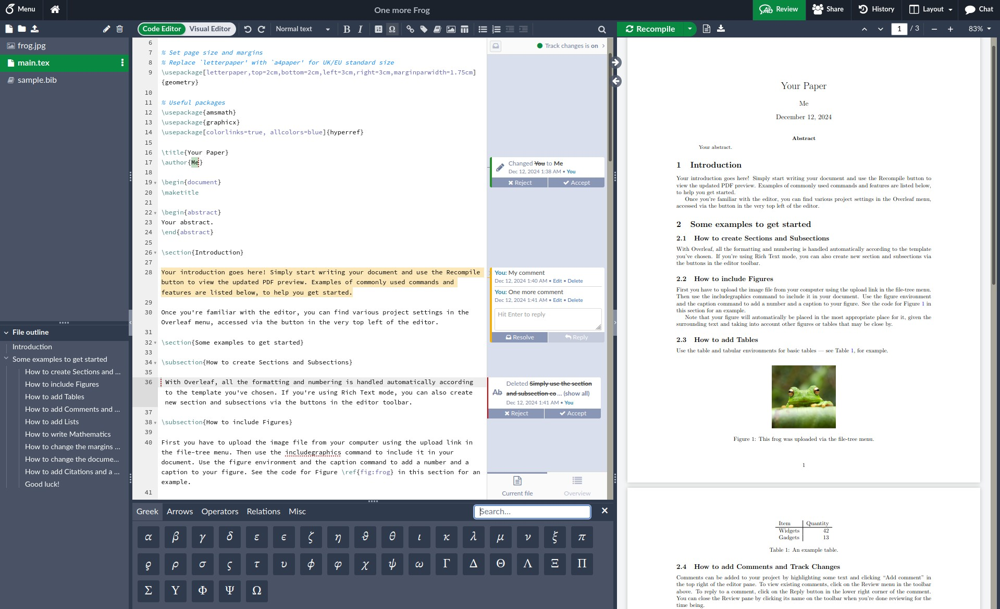

<h1 align="center">
  <br>
  <a href="https://www.overleaf.com"></a>
</h1>

<h4 align="center">An open-source online real-time collaborative LaTeX editor.</h4>

<p align="center">
  <a href="https://github.com/overleaf/overleaf/wiki">Wiki</a> •
  <a href="https://www.overleaf.com/for/enterprises">Server Pro</a> •
  <a href="#contributing">Contributing</a> •
  <a href="https://mailchi.mp/overleaf.com/community-edition-and-server-pro">Mailing List</a> •
  <a href="#authors">Authors</a> •
  <a href="#license">License</a>
</p>


<p align="center">
  Figure 1: A screenshot of a project being edited in extended Overleaf Community Edition.
</p>

## Community Edition

[Overleaf](https://www.overleaf.com) is an open-source online real-time collaborative LaTeX editor. Overleaf runs a hosted version at [www.overleaf.com](https://www.overleaf.com), but you can also run your own local version, and contribute to the development of Overleaf.

## Extended Community Edition

The present "extended" version of Overleaf CE includes:

- LDAP authentication
- SAML authentication
- Real-time track changes and comments
- Autocomplete of reference keys

## Enterprise

If you want help installing and maintaining Overleaf in your lab or workplace, Overleaf an officially supported version called [Overleaf Server Pro](https://www.overleaf.com/for/enterprises).

## Installation

Detailed installation instructions can be found in the [Overleaf Toolkit](https://github.com/overleaf/toolkit/).
To run a custom image, add a file named docker-compose.override.yml with the following or similar content into the ./overleaf-toolkit/config directory:

```
---
version: '2.2'
services:
    sharelatex:
        image: sharelatex/sharelatex:extce
        volumes:
          - ../config/certs:/overleaf/certs
```
Here, the attached volume provides convenient access for the container to the certificates needed for SAML or LDAP authentication.

If you want to build a Docker image of the extended CE based on the upstream v5.2.1 codebase, check out the corresponding tag by running 
```
git checkout v5.2.1-extce
```

## Authentication Methods

The following authentication methods are supported: Local authentication, LDAP authentication, and SAML authentication. Local authentication is always active.
To enable LDAP or SAML authentication, the environment variable `EXTERNAL_AUTH` must be set to `ldap` or `saml`, respectively.

<details>
<summary><h3>Local Authentication</h3></summary>

Password of local users stored in the MongoDB database. An admin user can create a new local user. For details, visit the
[wiki of Overleaf project](https://github.com/overleaf/overleaf/wiki/Creating-and-managing-users).

It is possible to enforce password restrictions on local users:


* `OVERLEAF_PASSWORD_VALIDATION_MIN_LENGTH`: The minimum length required

* `OVERLEAF_PASSWORD_VALIDATION_MAX_LENGTH`: The maximum length allowed

* `OVERLEAF_PASSWORD_VALIDATION_PATTERN`: is used to validate password strength

  - `abc123` – password requires 3 letters and 3 numbers and be at least 6 characters long
  - `aA` – password requires lower and uppercase letters and be at least 2 characters long
  - `ab$3` – it must contain letters, digits and symbols and be at least 4 characters long
  - There are 4 groups of characters: letters, UPPERcase letters, digits, symbols. Anything that is neither a letter nor a digit is considered to be a symbol.

</details>

<details>
<summary><h3>LDAP Authentication</h3></summary>

Internally, Overleaf LDAP uses the [passport-ldapauth](https://github.com/vesse/passport-ldapauth) library. Most of these configuration options are passed through to the `server` config object which is used to configure `passport-ldapauth`. If you are having issues configuring LDAP, it is worth reading the README for `passport-ldapauth` to understand the configuration it expects.

#### Environment Variables

- `OVERLEAF_LDAP_URL` **(required)**
    * URL of the LDAP server.

      - Example: `ldaps://ldap.example.com:636` (LDAP over SSL)
      - Example: `ldap://ldap.example.com:389` (unencrypted or STARTTLS, if configured).

- `OVERLEAF_LDAP_EMAIL_ATT`
    * The email attribute returned by the LDAP server, default `mail`. Each LDAP user must have at least one email address.
      If multiple addresses are provided, only the first one will be used.

- `OVERLEAF_LDAP_FIRST_NAME_ATT`
    * The property name holding the first name of the user which is used in the application, usually `givenName`.

- `OVERLEAF_LDAP_LAST_NAME_ATT`
    * The property name holding the family name of the user which is used in the application, usually `sn`.

- `OVERLEAF_LDAP_NAME_ATT`
    * The property name holding the full name of the user, usually `cn`. If either of the two previous variables is not defined,
      the first and/or last name of the user is extracted from this variable. Otherwise, it is not used.

- `OVERLEAF_LDAP_PLACEHOLDER`
    * The placeholder for the login form, defaults to `Username`.

- `OVERLEAF_LDAP_UPDATE_USER_DETAILS_ON_LOGIN`
    * If set to `true`, updates the LDAP user `first_name` and `last_name` field on login, and turn off the user details form on the `/user/settings`
      page for LDAP users. Otherwise, details will be fetched only on first login.

- `OVERLEAF_LDAP_BIND_DN`
    * The distinguished name of the LDAP user that should be used for the LDAP connection
      (this user should be able to search/list accounts on the LDAP server),
      e.g., `cn=ldap_reader,dc=example,dc=com`. If not defined, anonymous binding is used.

- `OVERLEAF_LDAP_BIND_CREDENTIALS`
    * Password for `OVERLEAF_LDAP_BIND_DN`.

- `OVERLEAF_LDAP_BIND_PROPERTY`
    * Property of the user to bind against the client, defaults to `dn`.

- `OVERLEAF_LDAP_SEARCH_BASE` **(required)**
    * The base DN from which to search for users. E.g., `ou=people,dc=example,dc=com`.

- `OVERLEAF_LDAP_SEARCH_FILTER`
    * LDAP search filter with which to find a user. Use the literal '{{username}}' to have the given username be interpolated in for the LDAP search.

      - Example: `(|(uid={{username}})(mail={{username}}))` (user can login with email or with login name).
      - Example: `(sAMAccountName={{username}})` (Active Directory).

- `OVERLEAF_LDAP_SEARCH_SCOPE`
    * The scope of the search can be `base`, `one`, or `sub` (default).

- `OVERLEAF_LDAP_SEARCH_ATTRIBUTES`
    * JSON array of attributes to fetch from the LDAP server, e.g., `["uid", "mail", "givenName", "sn"]`.
      By default, all attributes are fetched.

- `OVERLEAF_LDAP_STARTTLS`
    * If `true`, LDAP over TLS is used.

- `OVERLEAF_LDAP_TLS_OPTS_CA_PATH`
    * Path to the file containing the CA certificate used to verify the LDAP server's SSL/TLS certificate. If there are multiple certificates, then
      it can be a JSON array of paths to the certificates. The files must be accessible to the docker container.

      - Example (one certificate): `/overleaf/certs/ldap_ca_cert.pem`
      - Example (multiple certificates): `["/overleaf/certs/ldap_ca_cert1.pem", "/overleaf/certs/ldap_ca_cert2.pem"]`

- `OVERLEAF_LDAP_TLS_OPTS_REJECT_UNAUTH`
    * If `true`, the server certificate is verified against the list of supplied CAs.

- `OVERLEAF_LDAP_CACHE`
    * If `true`, then up to 100 credentials at a time will be cached for 5 minutes.

- `OVERLEAF_LDAP_TIMEOUT`
    * How long the client should let operations live for before timing out, ms (Default: Infinity).

- `OVERLEAF_LDAP_CONNECT_TIMEOUT`
    * How long the client should wait before timing out on TCP connections, ms (Default: OS default).

- `OVERLEAF_LDAP_IS_ADMIN_ATT` and `OVERLEAF_LDAP_IS_ADMIN_ATT_VALUE`
    * When both environment variables are set, the login process updates `user.isAdmin = true` if the LDAP profile contains the attribute specified by
     `OVERLEAF_LDAP_IS_ADMIN_ATT` and its value either matches `OVERLEAF_LDAP_IS_ADMIN_ATT_VALUE` or is an array containing `OVERLEAF_LDAP_IS_ADMIN_ATT_VALUE`,
      otherwise `user.isAdmin` is set to `false`. If either of these variables is not set, then the admin status is only set to `true` during admin user
      creation in Launchpad.

The following five variables are used to configure how user contacts are retrieved from the LDAP server.

- `OVERLEAF_LDAP_CONTACTS_FILTER`
    * The filter used to search for users in the LDAP server to be loaded into contacts. The placeholder '{{userProperty}}' within the filter is replaced with the value of
    the property specified by `OVERLEAF_LDAP_CONTACTS_PROPERTY` from the LDAP user initiating the search. If not defined, no users are retrieved from the LDAP server into contacts.

- `OVERLEAF_LDAP_CONTACTS_SEARCH_BASE`
    * Specifies the base DN from which to start searching for the contacts. Defaults to `OVERLEAF_LDAP_SEARCH_BASE`.

- `OVERLEAF_LDAP_CONTACTS_SEARCH_SCOPE`
    * The scope of the search can be `base`, `one`, or `sub` (default).

- `OVERLEAF_LDAP_CONTACTS_PROPERTY`
    * Specifies the property of the user object that will replace the '{{userProperty}}' placeholder in the `OVERLEAF_LDAP_CONTACTS_FILTER`.

- `OVERLEAF_LDAP_CONTACTS_NON_LDAP_VALUE`
    * Specifies the value of the `OVERLEAF_LDAP_CONTACTS_PROPERTY` if the search is initiated by a non-LDAP user. If this variable is not defined, the resulting filter
      will match nothing. The value `*` can be used as a wildcard.

<details>
<summary><h5>Example</h5></summary>

    OVERLEAF_LDAP_CONTACTS_FILTER=(gidNumber={{userProperty}})
    OVERLEAF_LDAP_CONTACTS_PROPERTY=gidNumber
    OVERLEAF_LDAP_CONTACTS_NON_LDAP_VALUE=1000

The above example results in loading into the contacts of the current LDAP user all LDAP users who have the same UNIX `gid`. Non-LDAP users will have all LDAP users with UNIX `gid=1000` in their contacts.

</details>


<details>
<summary><h4>Sample variables.env file</h4></summary>

```
OVERLEAF_APP_NAME="Our Overleaf Instance"

ENABLED_LINKED_FILE_TYPES=project_file,project_output_file

# Enables Thumbnail generation using ImageMagick
ENABLE_CONVERSIONS=true

# Disables email confirmation requirement
EMAIL_CONFIRMATION_DISABLED=true

## Nginx
# NGINX_WORKER_PROCESSES=4
# NGINX_WORKER_CONNECTIONS=768

## Set for TLS via nginx-proxy
# OVERLEAF_BEHIND_PROXY=true
# OVERLEAF_SECURE_COOKIE=true

OVERLEAF_SITE_URL=http://my-overleaf-instance.com
OVERLEAF_NAV_TITLE=Our Overleaf Instance
# OVERLEAF_HEADER_IMAGE_URL=http://somewhere.com/mylogo.png
OVERLEAF_ADMIN_EMAIL=support@example.com

OVERLEAF_LEFT_FOOTER=[{"text": "Contact your support team", "url": "mailto:support@example.com"}]
OVERLEAF_RIGHT_FOOTER=[{"text":"Hello, I am on the Right", "url":"https://github.com/yu-i-i/overleaf-cep"}]

OVERLEAF_EMAIL_FROM_ADDRESS=team@example.com
OVERLEAF_EMAIL_SMTP_HOST=smtp.example.com
OVERLEAF_EMAIL_SMTP_PORT=587
OVERLEAF_EMAIL_SMTP_SECURE=false
# OVERLEAF_EMAIL_SMTP_USER=
# OVERLEAF_EMAIL_SMTP_PASS=
# OVERLEAF_EMAIL_SMTP_NAME=
OVERLEAF_EMAIL_SMTP_LOGGER=false
OVERLEAF_EMAIL_SMTP_TLS_REJECT_UNAUTH=true
OVERLEAF_EMAIL_SMTP_IGNORE_TLS=false
OVERLEAF_CUSTOM_EMAIL_FOOTER=This system is run by department x

OVERLEAF_PROXY_LEARN=true
NAV_HIDE_POWERED_BY=true

#################
## LDAP for CE ##
#################

EXTERNAL_AUTH=ldap
OVERLEAF_LDAP_URL=ldap://ldap.example.com:389
OVERLEAF_LDAP_STARTTLS=true
OVERLEAF_LDAP_TLS_OPTS_CA_PATH=/overleaf/certs/ldap_ca_cert.pem
OVERLEAF_LDAP_SEARCH_BASE=ou=people,dc=example,dc=com
OVERLEAF_LDAP_SEARCH_FILTER=(|(uid={{username}})(mail={{username}}))
OVERLEAF_LDAP_BIND_DN=cn=ldap_reader,dc=example,dc=com
OVERLEAF_LDAP_BIND_CREDENTIALS=GoodNewsEveryone
OVERLEAF_LDAP_EMAIL_ATT=mail
OVERLEAF_LDAP_FIRST_NAME_ATT=givenName
OVERLEAF_LDAP_LAST_NAME_ATT=sn
# OVERLEAF_LDAP_NAME_ATT=cn
OVERLEAF_LDAP_SEARCH_ATTRIBUTES=["uid", "sn", "givenName", "mail"]

OVERLEAF_LDAP_UPDATE_USER_DETAILS_ON_LOGIN=true

OVERLEAF_LDAP_PLACEHOLDER='Username or email address'

OVERLEAF_LDAP_IS_ADMIN_ATT=mail
OVERLEAF_LDAP_IS_ADMIN_ATT_VALUE=admin@example.com

OVERLEAF_LDAP_CONTACTS_FILTER=(gidNumber={{userProperty}})
OVERLEAF_LDAP_CONTACTS_PROPERTY=gidNumber
OVERLEAF_LDAP_CONTACTS_NON_LDAP_VALUE='*'
```
</details>

<details>
<summary><i>Deprecated variables</i></summary>

**These variables will be removed soon**, use `OVERLEAF_LDAP_IS_ADMIN_ATT` and `OVERLEAF_LDAP_IS_ADMIN_ATT_VALUE` instead.

The following variables are used to determine if the user has admin rights.
Please note: the user gains admin status if the search result is not empty, not when the user is explicitly included in the search results.

- `OVERLEAF_LDAP_ADMIN_SEARCH_BASE`
    * Specifies the base DN from which to start searching for the admin group. If this variable is defined,
    `OVERLEAF_LDAP_ADMIN_SEARCH_FILTER` must also be defined for the search to function properly.

- `OVERLEAF_LDAP_ADMIN_SEARCH_FILTER`
    * Defines the LDAP search filter used to identify the admin group. The placeholder `{{dn}}` within the filter
      is replaced with the value of the property specified by `OVERLEAF_LDAP_ADMIN_DN_PROPERTY`. The placeholder `{{username}}` is also supported.

- `OVERLEAF_LDAP_ADMIN_DN_PROPERTY`
    * Specifies the property of the user object that will replace the '{{dn}}' placeholder
      in the `OVERLEAF_LDAP_ADMIN_SEARCH_FILTER`, defaults to `dn`.

- `OVERLEAF_LDAP_ADMIN_SEARCH_SCOPE`
    * The scope of the LDAP search can be `base`, `one`, or `sub` (default)

<details>
<summary><h5>Example</h5></summary>

In the following example admins are members of a group `admins`, the objectClass of the entry `admins` is `groupOfNames`:

    OVERLEAF_LDAP_ADMIN_SEARCH_BASE='cn=admins,ou=group,dc=example,dc=com'
    OVERLEAF_LDAP_ADMIN_SEARCH_FILTER='(member={{dn}})'

In the following example admins are members of a group 'admins', the objectClass of the entry `admins` is `posixGroup`:

    OVERLEAF_LDAP_ADMIN_SEARCH_BASE='cn=admins,ou=group,dc=example,dc=com'
    OVERLEAF_LDAP_ADMIN_SEARCH_FILTER='(memberUid={{username}})'

In the following example admins are users with UNIX gid=1234:

    OVERLEAF_LDAP_ADMIN_SEARCH_BASE='ou=people,dc=example,dc=com'
    OVERLEAF_LDAP_ADMIN_SEARCH_FILTER='(&(gidNumber=1234)(uid={{username}}))'

In the following example admin is the user with `uid=someuser`:

    OVERLEAF_LDAP_ADMIN_SEARCH_BASE='ou=people,dc=example,dc=com'
    OVERLEAF_LDAP_ADMIN_SEARCH_FILTER='(&(uid=someuser)(uid={{username}}))'

The filter

    OVERLEAF_LDAP_ADMIN_SEARCH_FILTER='(uid=someuser)'

where `someuser` is the uid of an existing user, will always produce a non-empty search result.
As a result, **every user will be granted admin rights**, not just `someuser`, as one might expect.

</details>
</details>
</details>

<details>
<summary><h3>SAML Authentication</h3></summary>

Internally, Overleaf SAML module uses the [passport-saml](https://github.com/node-saml/passport-saml) library, most of the following
configuration options are passed through to `passport-saml`. If you are having issues configuring SAML, it is worth reading the README
for `passport-saml` to get a feel for the configuration it expects.

#### Environment Variables

- `OVERLEAF_SAML_IDENTITY_SERVICE_NAME`
    * Display name for the identity service, used on the login page (default: `Login with SAML IdP`).

- `OVERLEAF_SAML_EMAIL_FIELD`
    * Name of the Email field in user profile, default to 'nameID'.

- `OVERLEAF_SAML_FIRST_NAME_FIELD`
    * Name of the firstName field in user profile, default to 'givenName'.

- `OVERLEAF_SAML_LAST_NAME_FIELD`
    * Name of the lastName field in user profile, default to 'lastName'

- `OVERLEAF_SAML_UPDATE_USER_DETAILS_ON_LOGIN`
    * If set to `true`, updates the user `first_name` and `last_name` field on login,
      and turn off the user details form on `/user/settings` page.

- `OVERLEAF_SAML_ENTRYPOINT` **(required)**
    * Entrypoint URL for the SAML identity service.

      - Example: `https://idp.example.com/simplesaml/saml2/idp/SSOService.php`
      - Azure Example: `https://login.microsoftonline.com/8b26b46a-6dd3-45c7-a104-f883f4db1f6b/saml2`

- `OVERLEAF_SAML_CALLBACK_URL` **(required)**
    * Callback URL for Overleaf service. Should be the full URL of the `/saml/login/callback` path.

      - Example: `https://my-overleaf-instance.com/saml/login/callback`

- `OVERLEAF_SAML_ISSUER` **(required)**
    * The Issuer name.

- `OVERLEAF_SAML_AUDIENCE`
    * Expected saml response Audience, defaults to value of `OVERLEAF_SAML_ISSUER`.

- `OVERLEAF_SAML_IDP_CERT` **(required)**
    * Path to a file containing the Identity Provider's public certificate, used to validate the signatures of incoming SAML responses. If the Identity Provider has multiple valid signing certificates, then
      it can be a JSON array of paths to the certificates.

        - Example (one certificate): `/overleaf/certs/idp_cert.pem`
        - Example (multiple certificates): `["/overleaf/certs/idp_cert.pem", "/overleaf/certs/idp_cert_old.pem"]`

- `OVERLEAF_SAML_PUBLIC_CERT`
    * Path to a file containing public signing certificate used to embed in auth requests in order for the IdP to validate the signatures of the incoming SAML Request. It's required when setting up the [metadata endpoint](#metadata-for-the-identity-provider)
      when the strategy is configured with a `OVERLEAF_SAML_PRIVATE_KEY`. A JSON array of paths to certificates can be provided to support certificate rotation. When supplying an array of certificates, the first entry in the array should match the
      current `OVERLEAF_SAML_PRIVATE_KEY`. Additional entries in the array can be used to publish upcoming certificates to IdPs before changing the `OVERLEAF_SAML_PRIVATE_KEY`.

- `OVERLEAF_SAML_PRIVATE_KEY`
    * Path to a file containing a PEM-formatted private key matching the `OVERLEAF_SAML_PUBLIC_CERT` used to sign auth requests sent by passport-saml.

- `OVERLEAF_SAML_DECRYPTION_CERT`
    *  Path to a file containing public certificate, used for the [metadata endpoint](#metadata-for-the-identity-provider).

- `OVERLEAF_SAML_DECRYPTION_PVK`
    * Path to a file containing private key  matching the `OVERLEAF_SAML_DECRYPTION_CERT` that will be used to attempt to decrypt any encrypted assertions that are received.

- `OVERLEAF_SAML_SIGNATURE_ALGORITHM`
    * Optionally set the signature algorithm for signing requests,
          valid values are 'sha1' (default), 'sha256' (prefered), 'sha256' (most secure, check if your IdP supports it).

- `OVERLEAF_SAML_ADDITIONAL_PARAMS`
    * JSON dictionary of additional query params to add to all requests.

- `OVERLEAF_SAML_ADDITIONAL_AUTHORIZE_PARAMS`
    * JSON dictionary of additional query params to add to 'authorize' requests.

          - Example: `{"some_key": "some_value"}`

- `OVERLEAF_SAML_IDENTIFIER_FORMAT`
    * Name identifier format to request from identity provider (default: `urn:oasis:names:tc:SAML:1.1:nameid-format:emailAddress`).

- `OVERLEAF_SAML_ACCEPTED_CLOCK_SKEW_MS`
    * Time in milliseconds of skew that is acceptable between client and server when checking OnBefore and NotOnOrAfter assertion
          condition validity timestamps. Setting to -1 will disable checking these conditions entirely. Default is 0.

- `OVERLEAF_SAML_ATTRIBUTE_CONSUMING_SERVICE_INDEX`
    * `AttributeConsumingServiceIndex` attribute to add to AuthnRequest to instruct the IdP which attribute set to attach
          to the response ([link](http://blog.aniljohn.com/2014/01/data-minimization-front-channel-saml-attribute-requests.html)).

- `OVERLEAF_SAML_AUTHN_CONTEXT`
    * JSON array of name identifier format values to request auth context. Default: `["urn:oasis:names:tc:SAML:2.0:ac:classes:PasswordProtectedTransport"]`.

- `OVERLEAF_SAML_FORCE_AUTHN`
    * If `true`, the initial SAML request from the service provider specifies that the IdP should force re-authentication of the user,
          even if they possess a valid session.

- `OVERLEAF_SAML_DISABLE_REQUESTED_AUTHN_CONTEXT`
    * If `true`, do not request a specific auth context. For example, you can this this to `true` to allow additional contexts such as password-less logins (`urn:oasis:names:tc:SAML:2.0:ac:classes:X509`). Support for additional contexts is dependant on your IdP.

- `OVERLEAF_SAML_AUTHN_REQUEST_BINDING`
    * If set to `HTTP-POST`, will request authentication from IdP via HTTP POST binding, otherwise defaults to HTTP-Redirect.

- `OVERLEAF_SAML_VALIDATE_IN_RESPONSE_TO`
    * If `always`, then InResponseTo will be validated from incoming SAML responses.
    * If `never`, then InResponseTo  won't be validated (default).
    * If `ifPresent`, then InResponseTo will only be validated if present in the incoming SAML response.

- `OVERLEAF_SAML_REQUEST_ID_EXPIRATION_PERIOD_MS`
    * Defines the expiration time when a Request ID generated for a SAML request will not be valid if seen
          in a SAML response in the `InResponseTo` field. Default: 28800000 (8 hours).

- `OVERLEAF_SAML_LOGOUT_URL`
    * base address to call with logout requests (default: `entryPoint`).

      - Example: `https://idp.example.com/simplesaml/saml2/idp/SingleLogoutService.php`

- `OVERLEAF_SAML_LOGOUT_CALLBACK_URL`
    * Callback URL for IdP initiated logout. Should be the full URL of the `/saml/logot/callback` path.
       With this value the `Location` attribute in the `SingleLogoutService` elements in the generated service provider metadata is populated with this value.

      - Example: `https://my-overleaf-instance.com/saml/logout/callback`

- `OVERLEAF_SAML_ADDITIONAL_LOGOUT_PARAMS`
    * JSON dictionary of additional query params to add to 'logout' requests.


- `OVERLEAF_SAML_IS_ADMIN_FIELD` and `OVERLEAF_SAML_IS_ADMIN_FIELD_VALUE`
    * When both environment variables are set, the login process updates `user.isAdmin = true` if the profile returned by the SAML IdP contains the attribute specified by
     `OVERLEAF_SAML_IS_ADMIN_FIELD` and its value either matches `OVERLEAF_SAML_IS_ADMIN_FIELD_VALUE` or is an array containing `OVERLEAF_SAML_IS_ADMIN_FIELD_VALUE`,
      otherwise `user.isAdmin` is set to `false`. If either of these variables is not set, then the admin status is only set to `true` during admin user.
      creation in Launchpad.

#### Metadata for the Identity Provider

The current version of Overleaf CE includes and endpoint to retrieve Service Provider Metadata: `http://my-overleaf-instance.com/saml/meta`

The Identity Provider will need to be configured to recognize the Overleaf server as a "Service Provider". Consult the documentation for your SAML server for instructions on how to do this.

Below is an example of appropriate Service Provider metadata:

<details>
<summary><h5>ol-meta.xml</h5></summary>

```
<?xml version="1.0"?>
<EntityDescriptor xmlns="urn:oasis:names:tc:SAML:2.0:metadata"
                  xmlns:ds="http://www.w3.org/2000/09/xmldsig#"
                  entityID="MyOverleaf"
                  ID="_b508c83b7dda452f5b269383fb391107116f8f57">
  <SPSSODescriptor protocolSupportEnumeration="urn:oasis:names:tc:SAML:2.0:protocol" AuthnRequestsSigned="true" WantAssertionsSigned="true">
    <KeyDescriptor use="signing">
      <ds:KeyInfo>
        <ds:X509Data>
          <ds:X509Certificate>MII...
[skipped]
</ds:X509Certificate>
        </ds:X509Data>
      </ds:KeyInfo>
    </KeyDescriptor>
    <KeyDescriptor use="encryption">
      <ds:KeyInfo>
        <ds:X509Data>
          <ds:X509Certificate>MII...
[skipped]
</ds:X509Certificate>
        </ds:X509Data>
      </ds:KeyInfo>
      <EncryptionMethod Algorithm="http://www.w3.org/2009/xmlenc11#aes256-gcm"/>
      <EncryptionMethod Algorithm="http://www.w3.org/2009/xmlenc11#aes128-gcm"/>
      <EncryptionMethod Algorithm="http://www.w3.org/2001/04/xmlenc#aes256-cbc"/>
      <EncryptionMethod Algorithm="http://www.w3.org/2001/04/xmlenc#aes128-cbc"/>
    </KeyDescriptor>
    <SingleLogoutService Binding="urn:oasis:names:tc:SAML:2.0:bindings:HTTP-POST"
                         Location="https://my-overleaf-instance.com/saml/logout/callback"/>
    <NameIDFormat>urn:oasis:names:tc:SAML:1.1:nameid-format:emailAddress</NameIDFormat>
    <AssertionConsumerService index="1"
                              isDefault="true"
                              Binding="urn:oasis:names:tc:SAML:2.0:bindings:HTTP-POST"
                              Location="https://my-overleaf-instance.com/saml/login/callback"/>
  </SPSSODescriptor>
</EntityDescriptor>

```
</details>

Note the certificates, `AssertionConsumerService.Location`, `SingleLogoutService.Location` and `EntityDescriptor.entityID`
and set as appropriate in your IdP configuration, or send the metadata file to the IdP admin.

<details>
<summary><h4>Sample variables.env file</h4></summary>

```
OVERLEAF_APP_NAME="Our Overleaf Instance"

ENABLED_LINKED_FILE_TYPES=project_file,project_output_file

# Enables Thumbnail generation using ImageMagick
ENABLE_CONVERSIONS=true

# Disables email confirmation requirement
EMAIL_CONFIRMATION_DISABLED=true

## Nginx
# NGINX_WORKER_PROCESSES=4
# NGINX_WORKER_CONNECTIONS=768

## Set for TLS via nginx-proxy
# OVERLEAF_BEHIND_PROXY=true
# OVERLEAF_SECURE_COOKIE=true

OVERLEAF_SITE_URL=http://my-overleaf-instance.com
OVERLEAF_NAV_TITLE=Our Overleaf Instance
# OVERLEAF_HEADER_IMAGE_URL=http://somewhere.com/mylogo.png
OVERLEAF_ADMIN_EMAIL=support@example.com

OVERLEAF_LEFT_FOOTER=[{"text": "Contact your support team", "url": "mailto:support@example.com"}]
OVERLEAF_RIGHT_FOOTER=[{"text":"Hello, I am on the Right", "url":"https://github.com/yu-i-i/overleaf-cep"}]

OVERLEAF_EMAIL_FROM_ADDRESS=team@example.com
OVERLEAF_EMAIL_SMTP_HOST=smtp.example.com
OVERLEAF_EMAIL_SMTP_PORT=587
OVERLEAF_EMAIL_SMTP_SECURE=false
# OVERLEAF_EMAIL_SMTP_USER=
# OVERLEAF_EMAIL_SMTP_PASS=
# OVERLEAF_EMAIL_SMTP_NAME=
OVERLEAF_EMAIL_SMTP_LOGGER=false
OVERLEAF_EMAIL_SMTP_TLS_REJECT_UNAUTH=true
OVERLEAF_EMAIL_SMTP_IGNORE_TLS=false
OVERLEAF_CUSTOM_EMAIL_FOOTER=This system is run by department x

OVERLEAF_PROXY_LEARN=true
NAV_HIDE_POWERED_BY=true

#################
## SAML for CE ##
#################

EXTERNAL_AUTH=saml
OVERLEAF_SAML_IDENTITY_SERVICE_NAME='Login with My IdP'
OVERLEAF_SAML_EMAIL_FIELD=mail
OVERLEAF_SAML_FIRST_NAME_FIELD=givenName
OVERLEAF_SAML_LAST_NAME_FIELD=sn
OVERLEAF_SAML_ENTRYPOINT=https://idp.example.com/simplesamlphp/saml2/idp/SSOService.php
OVERLEAF_SAML_CALLBACK_URL=https://my-overleaf-instance.com/saml/login/callback
OVERLEAF_SAML_LOGOUT_URL=https://idp.example.com/simplesamlphp/saml2/idp/SingleLogoutService.php
OVERLEAF_SAML_LOGOUT_CALLBACK_URL=https://my-overleaf-instance.com/saml/logout/callback
OVERLEAF_SAML_ISSUER=MyOverleaf
OVERLEAF_SAML_IDP_CERT=/overleaf/certs/idp_cert.pem
OVERLEAF_SAML_PUBLIC_CERT=/overleaf/certs/myol_cert.pem
OVERLEAF_SAML_PRIVATE_KEY=/overleaf/certs/myol_key.pem
OVERLEAF_SAML_DECRYPTION_CERT=/overleaf/certs/myol_decr_cert.pem
OVERLEAF_SAML_DECRYPTION_PVK=/overleaf/certs/myol_decr_key.pem
OVERLEAF_SAML_IS_ADMIN_FIELD=mail
OVERLEAF_SAML_IS_ADMIN_FIELD_VALUE=overleaf.admin@example.com
```
</details>
</details>


## Overleaf Docker Image

This repo contains two dockerfiles, [`Dockerfile-base`](server-ce/Dockerfile-base), which builds the
`sharelatex/sharelatex-base` image, and [`Dockerfile`](server-ce/Dockerfile) which builds the
`sharelatex/sharelatex` (or "community") image.

The Base image generally contains the basic dependencies like `wget` and
`aspell`, plus `texlive`. We split this out because it's a pretty heavy set of
dependencies, and it's nice to not have to rebuild all of that every time.

The `sharelatex/sharelatex` image extends the base image and adds the actual Overleaf code
and services.

Use `make build-base` and `make build-community` from `server-ce/` to build these images.

We use the [Phusion base-image](https://github.com/phusion/baseimage-docker)
(which is extended by our `base` image) to provide us with a VM-like container
in which to run the Overleaf services. Baseimage uses the `runit` service
manager to manage services, and we add our init-scripts from the `server-ce/runit`
folder.

## Authors

[The Overleaf Team](https://www.overleaf.com/about)
<br>
Extensions for CE by: [yu-i-i](https://github.com/yu-i-i/overleaf-cep)

## License

The code in this repository is released under the GNU AFFERO GENERAL PUBLIC LICENSE, version 3. A copy can be found in the [`LICENSE`](LICENSE) file.
